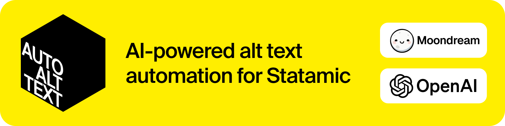

# Statamic Auto Alt Text

<p align="center">
  
  
</p>

> Automatically generate descriptive alt text for images in Statamic v5 using AI services (Moondream or OpenAI GPT-4 Vision)

## Features

- **Automatic Generation:** Generate alt text for assets using AI by listening for Statamic asset events
- **Multiple AI Providers:** Support for Moondream (cloud or self-hosted) and OpenAI (GPT-4 Vision)
- **Data Privacy:** Option to run Moondream locally, keeping image data within your infrastructure
- **Control Panel Integration:** Field Action to generate alt text for individual images
- **Bulk Processing:** Artisan Command for processing images individually or in batch

## Installation

```bash
composer require el-schneider/auto-alt-text
```

Publish the configuration file:

```bash
php artisan vendor:publish --tag="statamic-auto-alt-text-config"
```

## Configuration

By default, the addon uses the `moondream` service in `cloud` mode. Set your API key in your `.env` file:

```dotenv
MOONDREAM_API_KEY=your_api_key_here
```

Refer to the published configuration file (`config/statamic/auto-alt-text.php`) for additional options, including switching between services.

## Usage

### Automatic Generation

The addon listens for configured Statamic events (default: `AssetUploaded` and `AssetSaving`). When an asset without alt text is detected, a background job is dispatched to generate it automatically using your configured AI service.

> **Important:** This feature requires Laravel's queue system with an asynchronous queue driver (e.g., `database`, `redis`, `sqs`) and a running queue worker (`php artisan queue:work`). The default `sync` driver won't work for background processing.

Optionally customize the queue configuration:

```dotenv
# Optional: Defaults to your application's default queue connection
AUTO_ALT_TEXT_QUEUE_CONNECTION=redis

# Optional: Defaults to the default queue name for the connection
AUTO_ALT_TEXT_QUEUE_NAME=alt_text_generation
```

### Manual Generation

For existing assets or specific workflows:

1. **Field Action:** Edit an asset, find the `alt` text field, and click the "Generate Alt Text" action
2. **Statamic Action:** In an Asset container, use the "Generate Alt Text" action from the contextual menu
3. **CLI Command:** Process assets in bulk with:
   ```bash
   php artisan auto-alt:generate
   ```
   See `php artisan auto-alt:generate --help` for options to specify containers, assets, and overwriting behavior

### Using Local Moondream

For privacy or compliance reasons, you can run Moondream locally:

1. **Set up Moondream:** Follow the [Quickstart guide](https://moondream.ai/c/docs/quickstart) to set up a local Moondream server
2. **Configure the addon:** Update your `.env` file:
   ```dotenv
   # Switch to local mode
   MOONDREAM_MODE=local

   # Set your local server endpoint (default: http://localhost:2020/v1/caption)
   MOONDREAM_LOCAL_ENDPOINT=http://your-local-moondream-server:port/v1/caption
   ```
